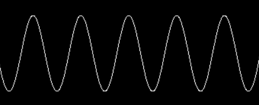
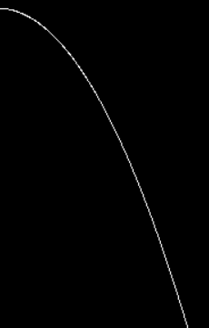

# gp
graph parser for C++.  
just input expression about x.  
then you'll get list of two dimensional vector.  

## Usage
```cpp
int main(const _argc, const char * const * const _argv) {
    gp::GraphParser _gp{};
    // gp::GraphParser::exec(expression : str, xBegin : real, xEnd : real, xStep : real, varMap : map)
    std::vector<gp::vec2> _vertices = _gp.exec("x + 1", 0.0f, 100.0f, 1.0f, {});
    for (const auto& _vertex : _vertices) {
      std::cout << _vertex.x << ", " << _vertex.y << "\n";
    }
}
```
## Supporting Operators
- Add (+)
- Sub (-)
- Mul (*)
- Div (/)
- Mod (%)
- Pow (^)

## Builtin Functions
- sin(x)
- cos(x)
- tan(x)
- asin(x)
- acos(x)
- atan(x)
- log(x)
- exp(x)
- sqrt(x)
- abs(x)

## Screenshot
| Sine Function | Quadratic Function |
| ---- | ---- |
| `y = sin(x / 10.0) * 50.0 + 100` | `y = (x / 10.0) ^ 2 + 100` |
|  |  |
